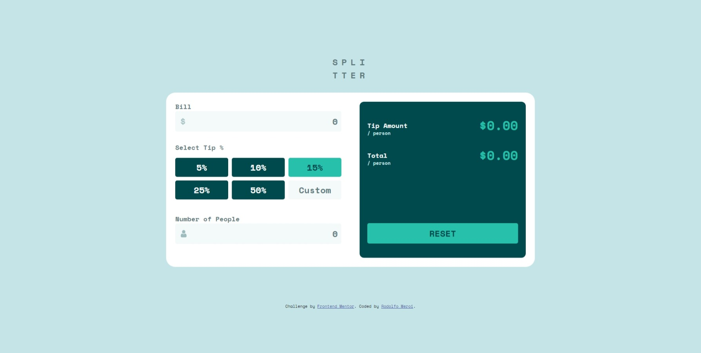
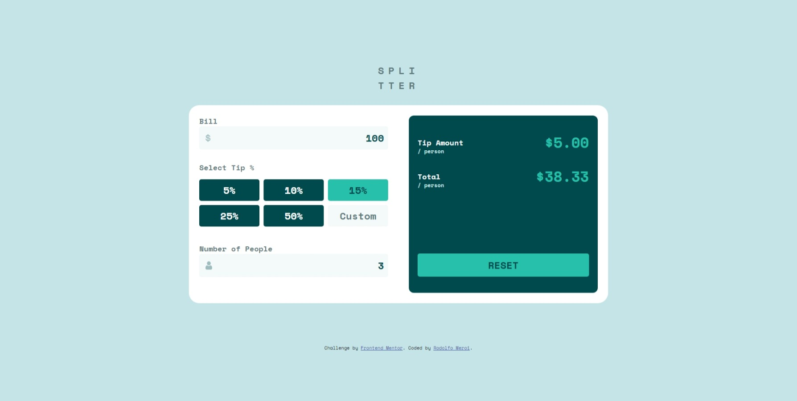
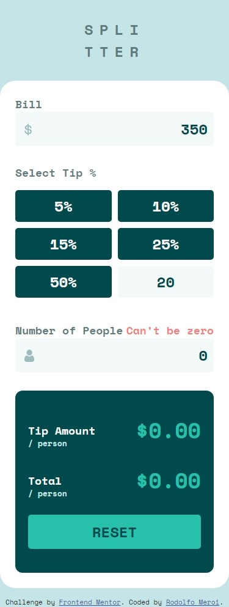

# Frontend Mentor - Tip calculator app solution

This is a solution to the [Tip calculator app challenge on Frontend Mentor](https://www.frontendmentor.io/challenges/tip-calculator-app-ugJNGbJUX). Frontend Mentor challenges help you improve your coding skills by building realistic projects.

## Table of contents

- [Overview](#overview)
  - [The challenge](#the-challenge)
  - [Screenshot](#screenshot)
  - [Links](#links)
  - [Built with](#built-with)
- [Author](#author)

## Overview

### The challenge

Users should be able to:

- View the optimal layout for the app depending on their device's screen size
- See hover states for all interactive elements on the page
- Calculate the correct tip and total cost of the bill per person

### Screenshot

### Links

- Live Site URL: [Here](https://rodom-tip-calculator.netlify.app/)

### Built with

- HTML5
- CSS
- JS

## Author

- Frontend Mentor - [@RodoM](https://www.frontendmentor.io/profile/RodoM)
- LinkedIN - [@Rodolfo Meroi](https://www.linkedin.com/in/rodolfo-meroi-858a13227/)